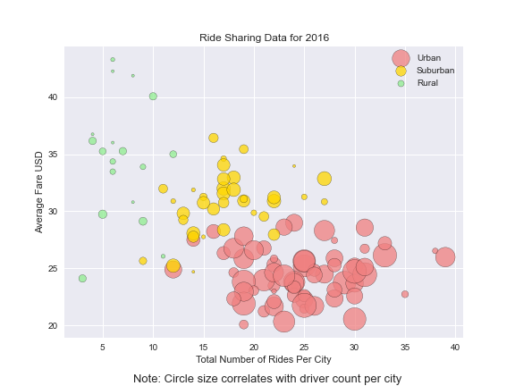
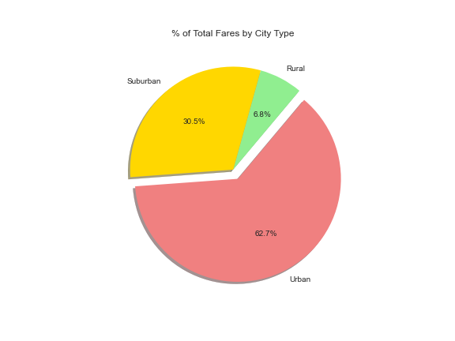
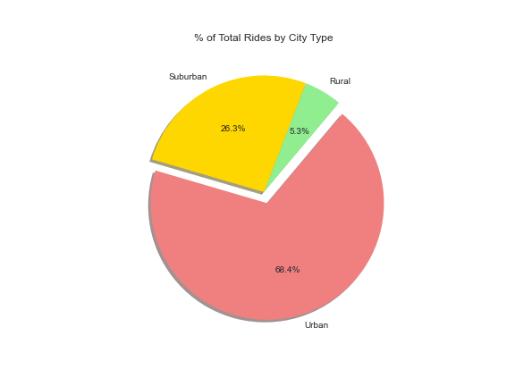
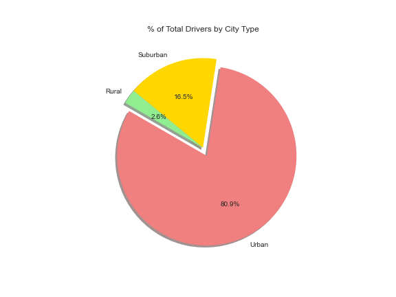

# Self-Learning: 5.1 Python Visualization for Rideshare Market

## Files

* [city_data.csv](data/city_data.csv)
* [ride_data.csv](data/ride_data.csv)

## Tasks

1. [Data Analysis](#Data-Analysis):
2. [Scatter Plot Analysis](#Scatter-Plot-Analysis)
3. [Pie Charts Analysis](#Pie-Chart-Analysis)

### Data Analysis

* __Scatter Plot Method__ : I merged the city_data and ride_data into one dataset that I can use to cross-reference each cities with the types they belong to. Then, the dataset is grouped by urban, suburban, and rural cities to create three dimensions that we can visualize using scatter plot. The three dimensions are the average fare for y-axis, number of rides for x-axis, and relative size of driver counts per city for scatter dot size. 

* __Pie Charts Method__ : In this case, three types of analysis can be done. The given data can be compared by visualizaing total fares, rides, and drivers by city types to gain market insights on how operating in different types of city can impact the rideshare business. 

### Scatter Plot Analysis

* __Observation__ : The scatter plot shows a decline in average price of fares as the cities become more urban. I suspect that the classic demand curve scenario is in play where the fare price is low to attract more people in the cities to use the rideshare service. In the suburban and rural cities, the high fares incentivize the drivers to work in the area where lower amount of rideshare customers are present.  Note that there are outliers with a few rural cities with low average fares. If we can look into the outliers, there might be a niche market rideshare businesses can take advantage of by accomodating specialized services.  

### Pie Chart Analysis

* __Total Fares by City Type__ : The pie chart shows 'Rural' 6.8%, 'Suburban' 30.5%, 'Urban' 62.7% as percentages of fares.

* __Total Rides by City Type__ : The pie chart shows 'Rural' 5.3% , 'Suburban' 26.3%, 'Urban' 68.4% as percentages of rides.

* __Total Drivers by City Type__ : The pie chart shows 'Rural' 2.6% , 'Suburban' 16.5%, 'Urban' 80.9% as percentages of drivers.

* __Observation__ : The pie chart visualizations in total shows that rural and suburban cities have higher percentages of fares and rides than the drivers while urban cities have higher percentage of drivers than the rides and fares. There is an opportunity for the rideshare businesses to increase the number of rideshare customers through marketing and advertisements assuming that the price is at the market equilibrium. Assuming the price can be adjusted, there's an opportunity to observe the change in driver numbers and demand from customers when the average fare prices of the ride are lowered.   